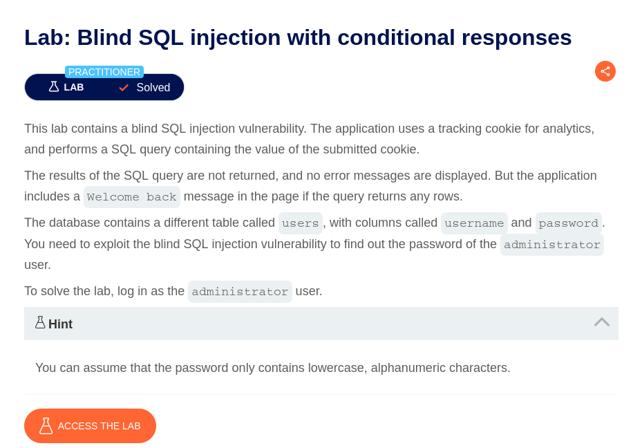
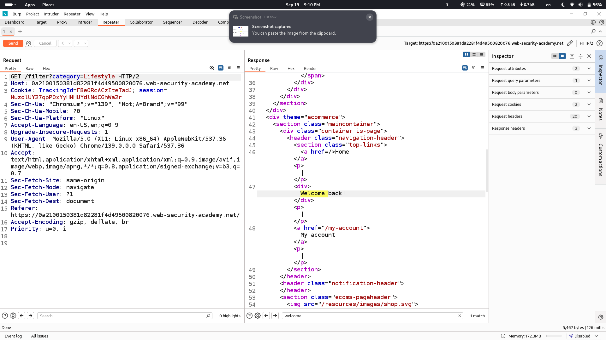
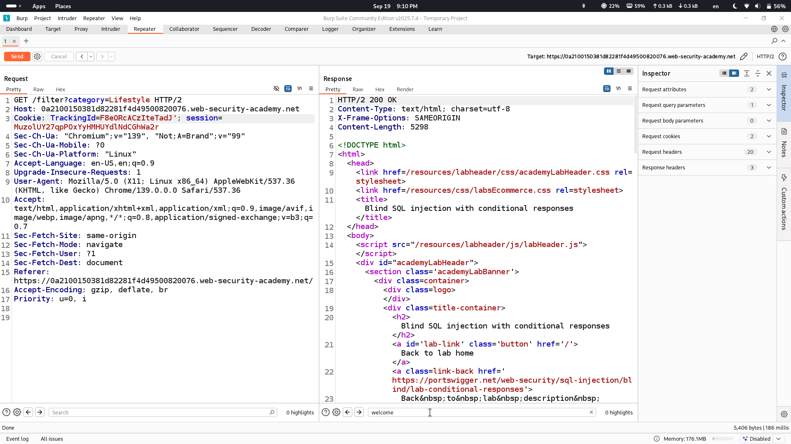
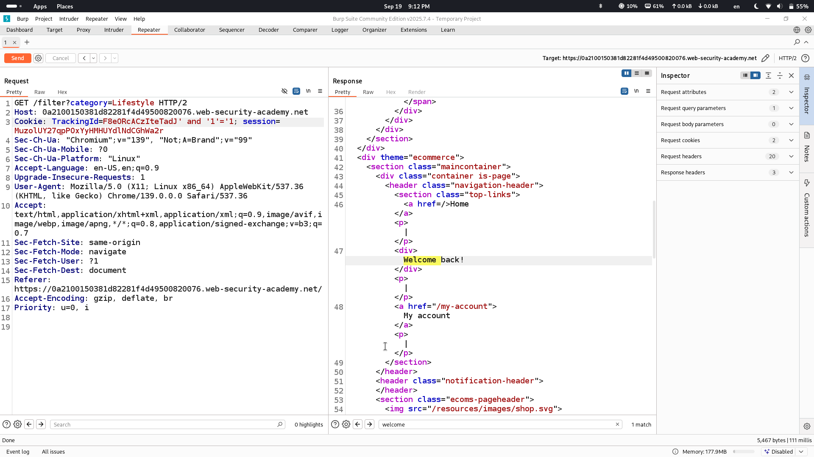
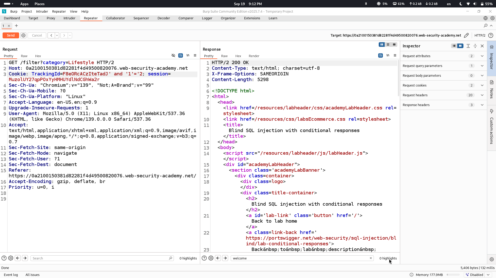
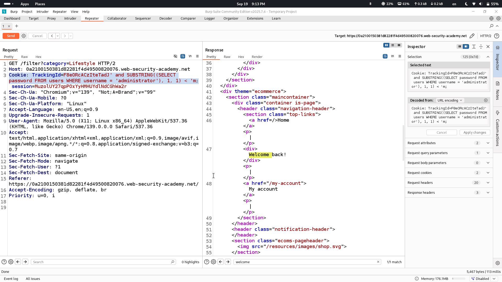
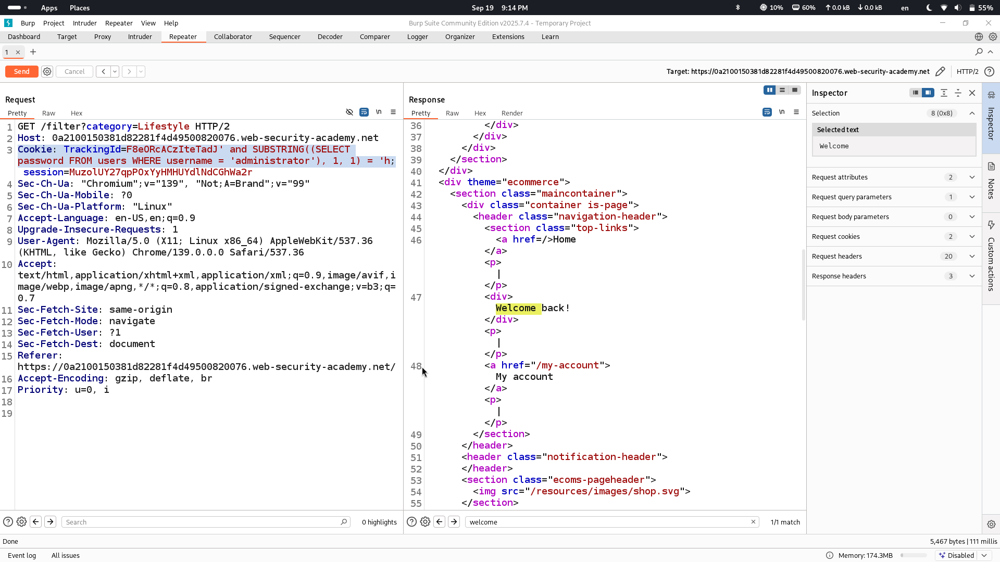
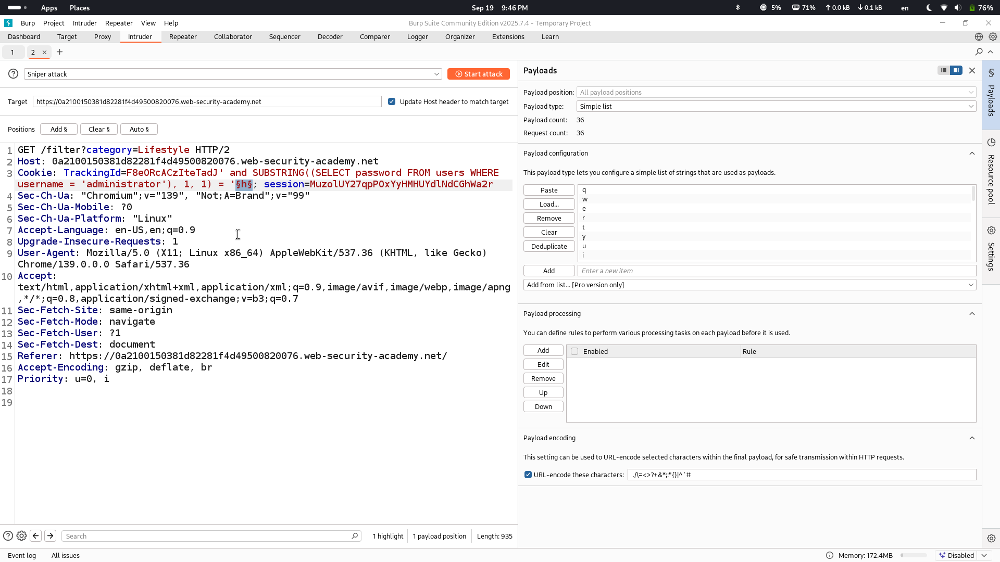

# Lab Description says

## as it states sql injection is in tracking cookie and when we get error from database "Welcome back!" message isn't returned and we will use blind sql injection method to retrieve data from database
# When just sending normal request we get Welcome back! message

## however if we send slightly edited Tracking cookie value we dont receive Welcome back! anymore

# POC of blind sqli being present by adding to payload (and '1'='1/ and '1'='2)

# We will retrieve data by comparing each character of desired column value with alphanumeric characters that we choose

## in this case we are comparing if first letter of administrator's password is less than 'm' and if it is less we are returned "Welcome back!" message, if first letter's ascii integer value was more than of m's we wouldn't have been returned "Welcome back!" message
# By comparing more and more we equal first letter of administrator's password to 'h' and we are returned "Welcome back!" which means that first letter of password is indeed h

## but to make things faster and automize everything I will use Burp's intruder section to do it

### this is how payload will look 
### every time I will get successful result I will increment "SUBSTRING((SELECT password FROM users WHERE username = 'administrator'), #1#, 1)" in this payload first one, the one that i added # sign

