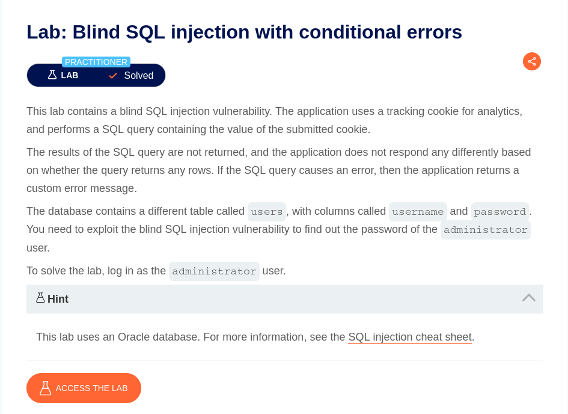
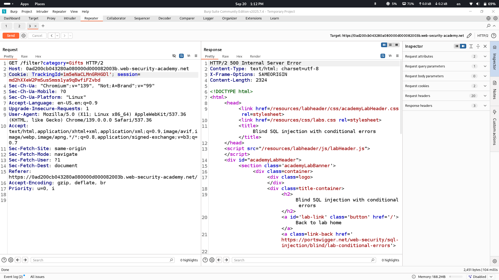
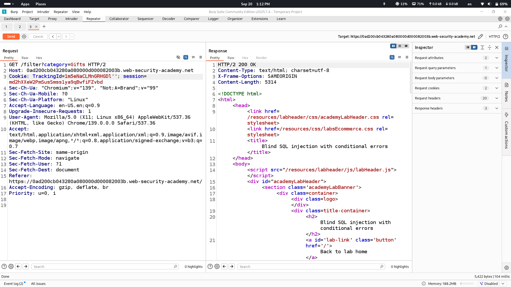
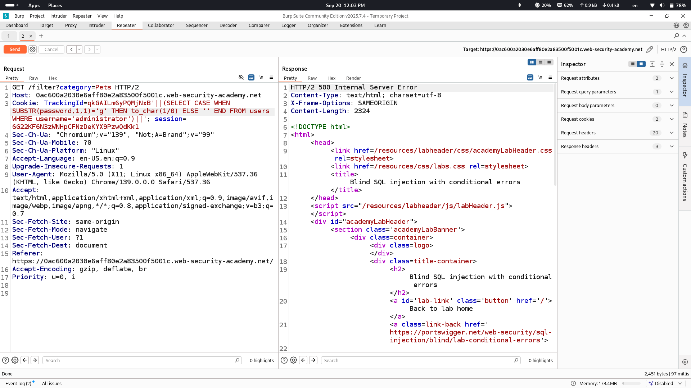

# Lab Description says

## injection part will be cookie tracking id
# Intendedly Receiving error messages

## when we add one ' sign we get error so syntax is changed on backend
## let's add one more ' sign to see if we will get 200 ok response (previouse apostrophe will be closed by the new one and error shouldn't be returned)

## as we see 200 ok response is returned
# This injection is called Error-based sql injection so let's use oracle oriented payload to retrieve data from backend

