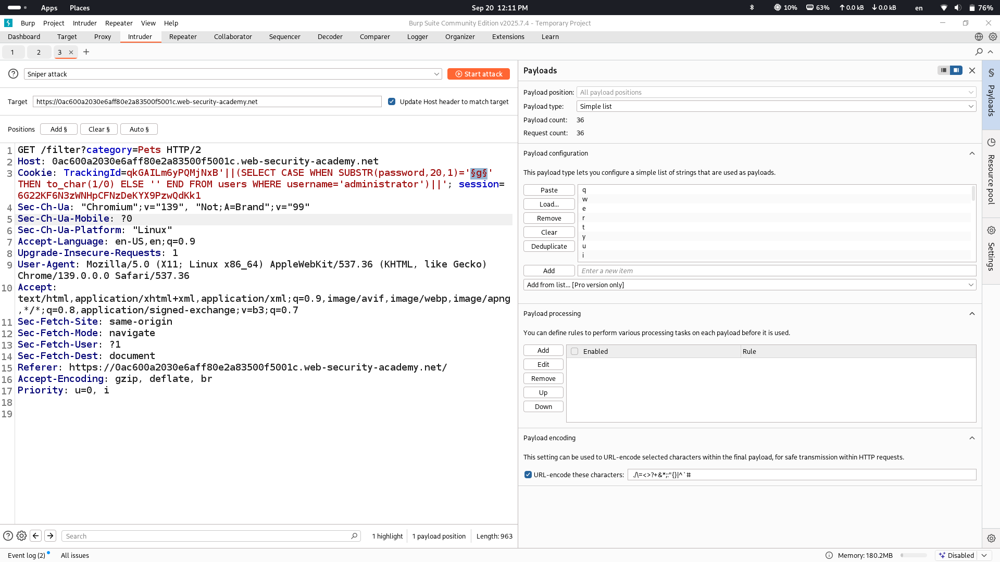
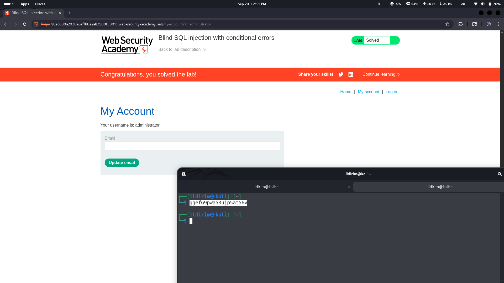

# Lab Description says

## injection part will be cookie tracking id
# Intendedly Receiving error messages

## when we add one ' sign we get error so syntax is changed on backend
## let's add one more ' sign to see if we will get 200 ok response (previouse apostrophe will be closed by the new one and error shouldn't be returned)

## as we see 200 ok response is returned
# This injection is called Error-based sql injection so let's use oracle oriented payload to retrieve data from backend

## in this payload if the condition inside case clause is true we should receive 500 response (1/0 causes error in database logic) from server, if not, 200 ok message is returned. By trial and errors we see that administrator user's password's first letter is 'g'
# To make things faster i will send this request to intruder and kind of automate password detection process

# In the end we get 20 character long password of administrator user and get access to this account

