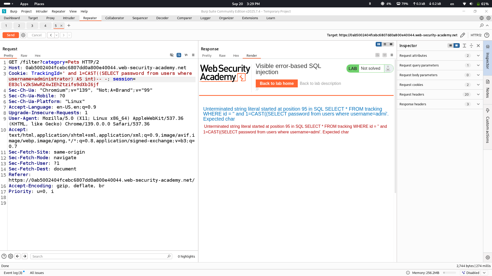
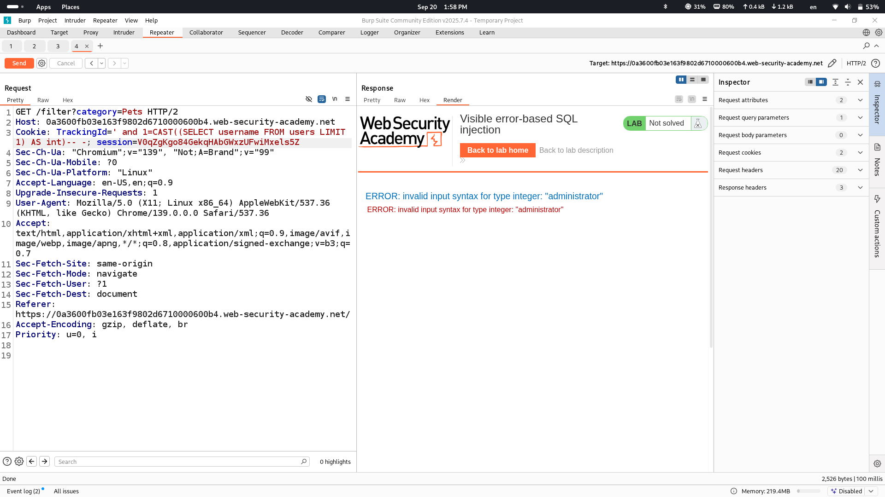
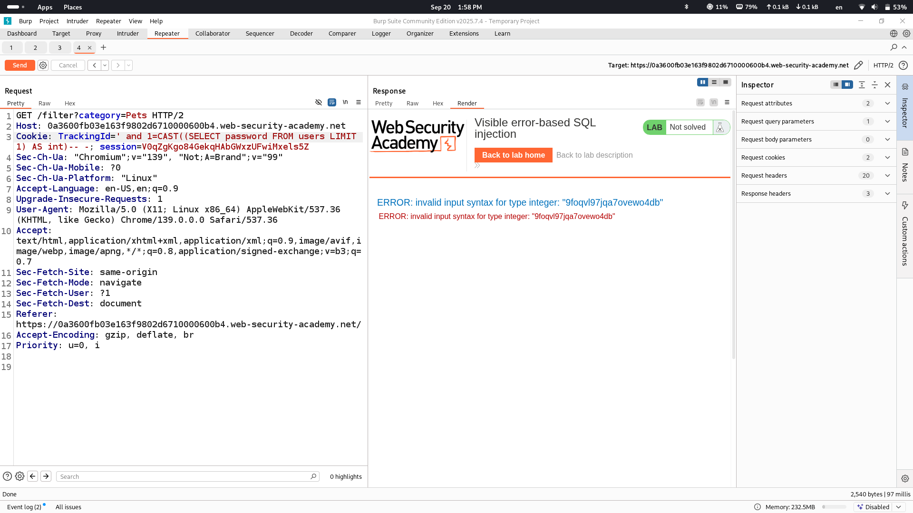
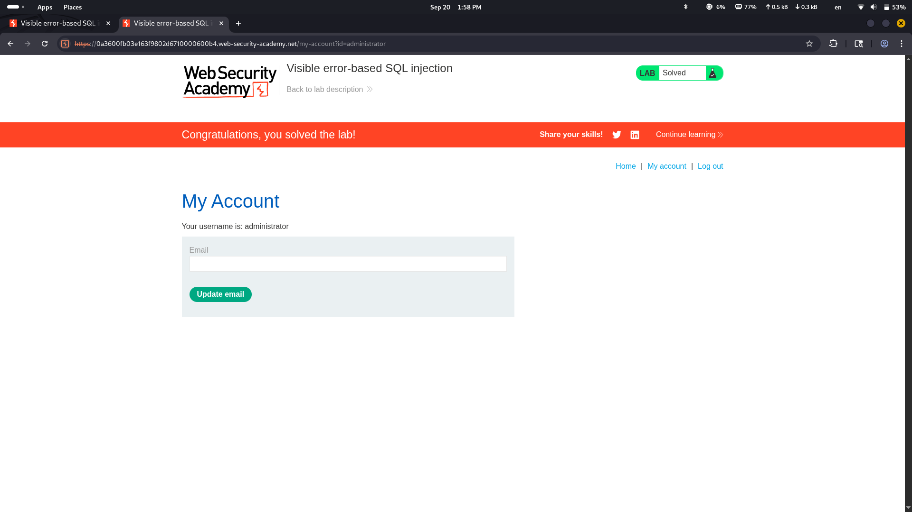

# Lab Description says

## from description we understand that we will need to make database show value of a column in error message let's see how it is done
# First what will be in response if add ' sign

## we see error which shows us entire sql query that is used on backend
# Let's retrieve password of administrator user from database

## CAST function is changing data type, as password is string value but we are changing it into integer password should be shown in error message, however this technique is not successful because query is cut on backend and it is not retrieving password in the end
## let's use another technique using LIMIT function.
# First user in users table

## great, administrator user is first user on backend so the only thing we need to do is retrieve first password from backend
# Password

# Success

