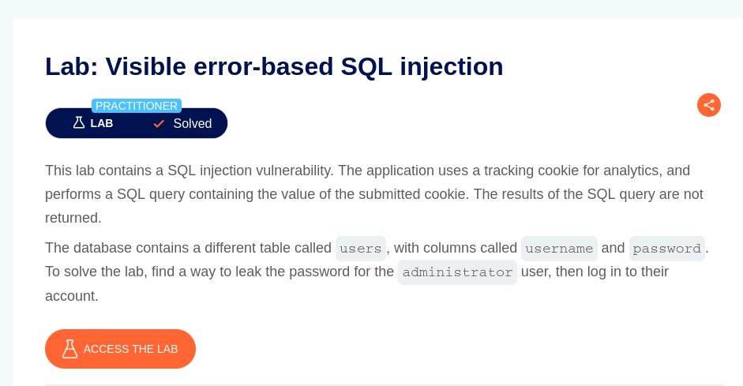
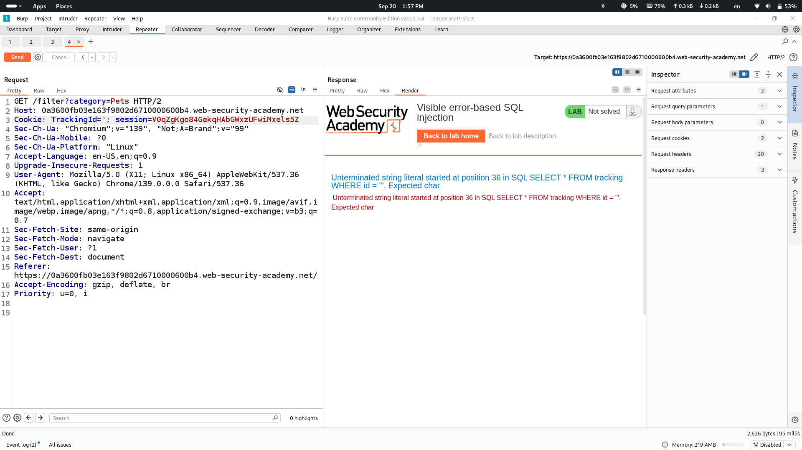

# Lab Description says

## from description we understand that we will need to make database show value of a column in error message let's see how it is done
# First what will be in response if add ' sign

## we see error which shows us entire sql query that is used on backend
