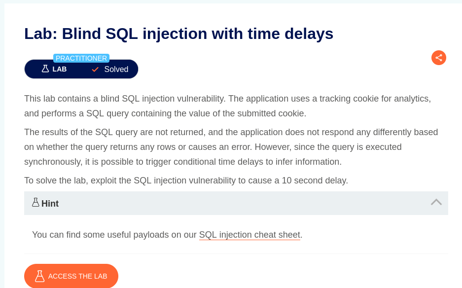
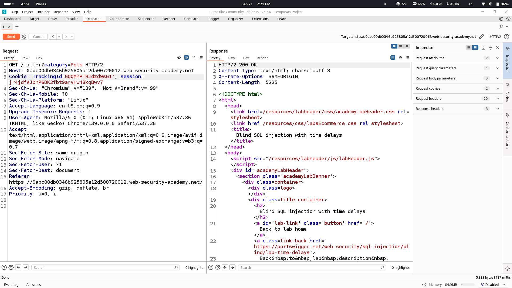

# Lab Description says

## according to description we will not see any errors and difference in response, however we can make database response a little longer compared to normal request let's see how it is done
# Trying to cause errors

## normal request 200 ok response

## adding ' sign to cause error but we still get 200 ok message
# Making database give response with 10 seconds delay

## as you see on gif media it takes 10 seconds to give response for application which means here is time based sql injection

