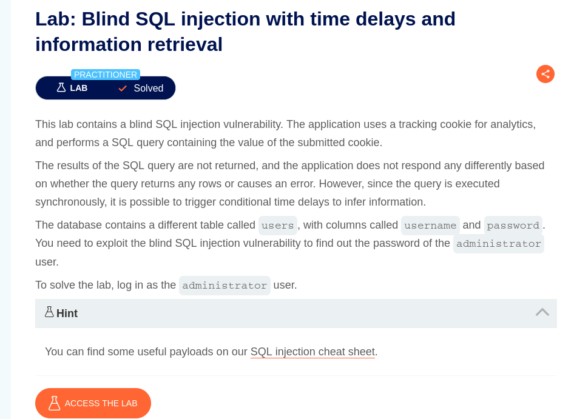
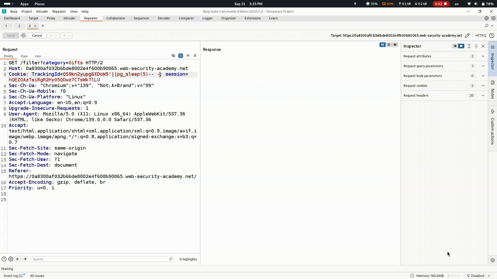
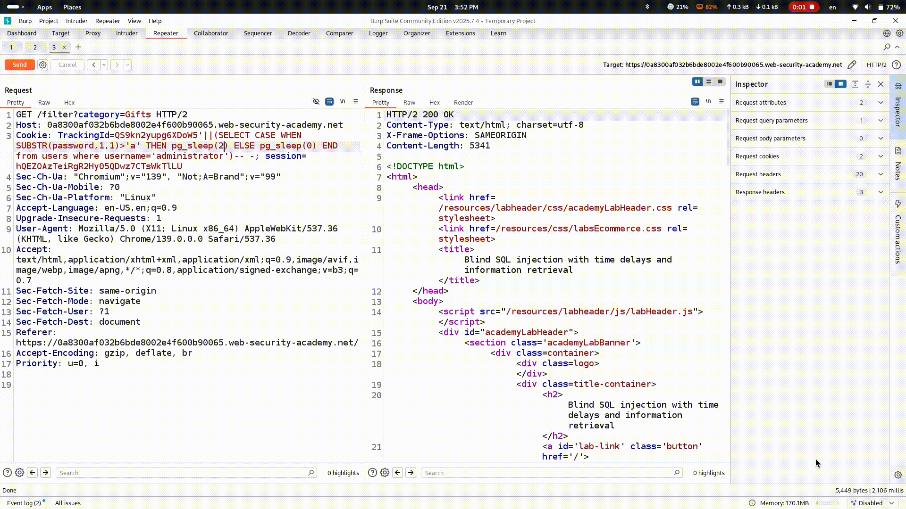
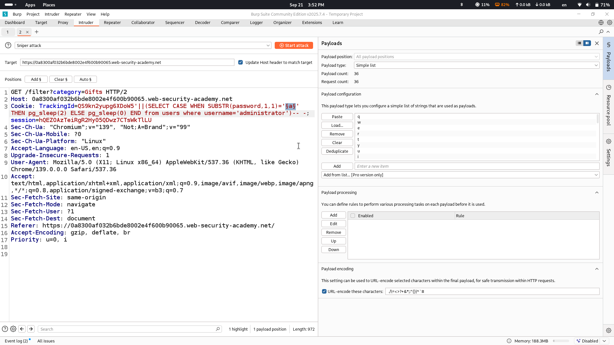
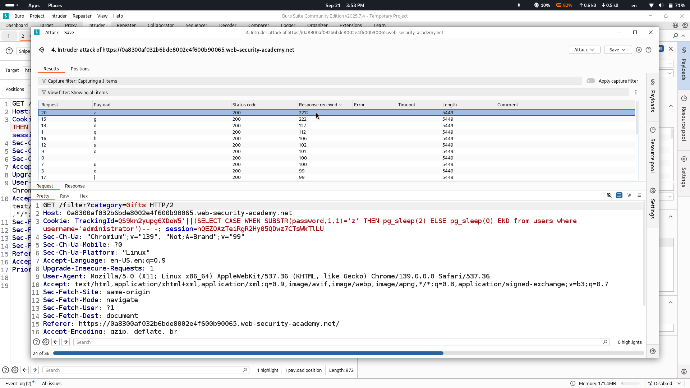
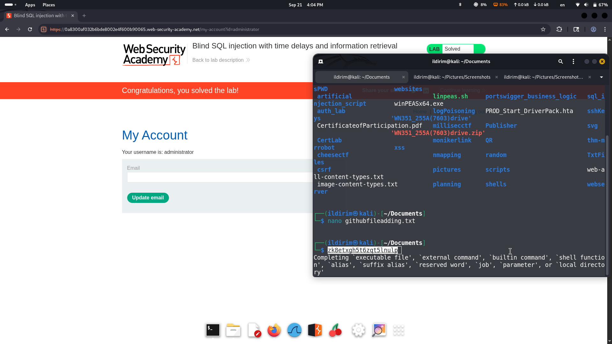

# Lab Description says

## we will use time based SQL injection to retrieve information from database
# Checkgin for time delay by injecting pg_sleep()

# Retrieving password of administrator user

## with this method by trial and errors in the end we will get what is the first character of administrator user's password however to make things faster i have sent this request to intruder

## and from the response we see that successful character took 2 seconds to be responded and by this we take notes of every character of password

# Solved

