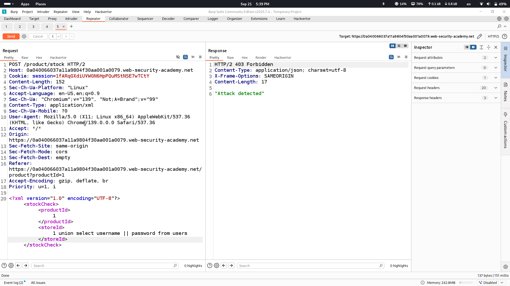

# Lab Description says

# Detecting number of columns in original query with "order by" method

## one column is used
# Encoding payload and retrieving data

## as you see we get 403 forbidden page which means we are blocked with this request let's use encoding method to bypass this as it is said in description

## by encoding payload with hackvertor we get password of administrator user and some other users
