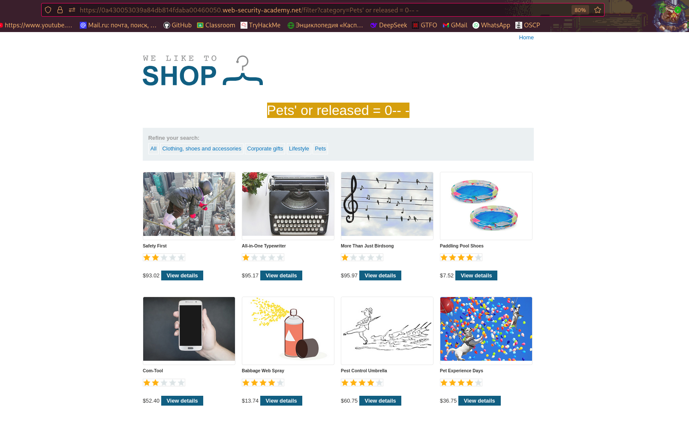

## Lab Description says this

according to this description we need to inject into payload "released = 0" to see products that arent released alongside with the ones that are released

## First let's see what application returns normally

## Next we need to test application for having SQLi vulnerability

as we see by adding '(apostrophe) we got encountered with an error and this is the indication that SQLi vulnerability is present

## Finally the injected payload to see all products is ' or released = 0-- -

