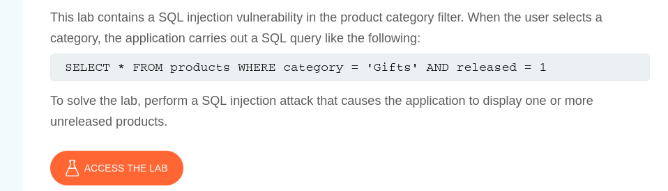

## Lab Description says this

according to this description we need to inject into payload "released = 0" to see products that arent released alongside with the ones that are released

## First let's see what application returns normally

