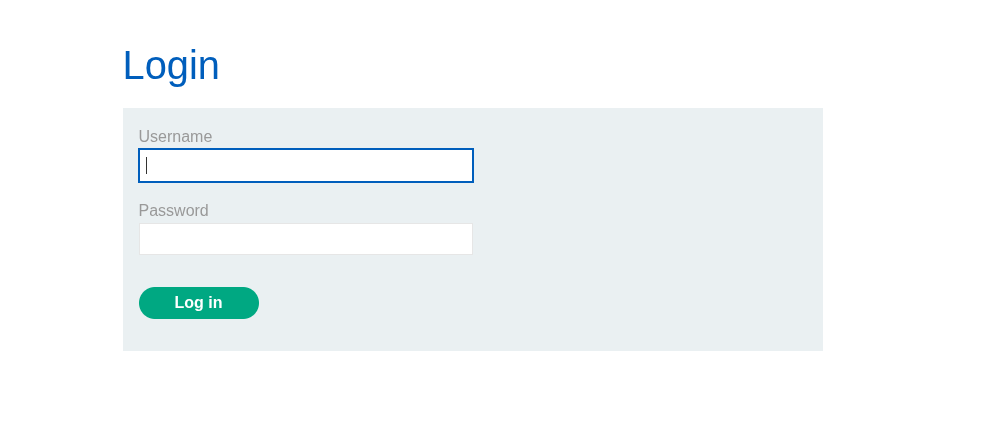
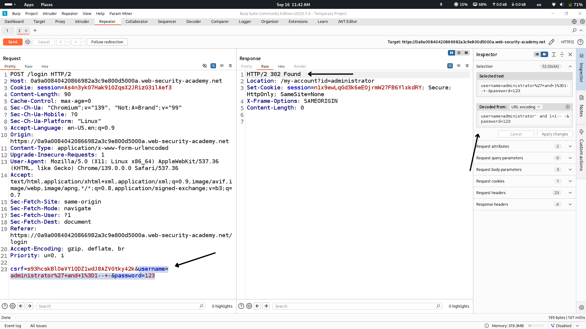
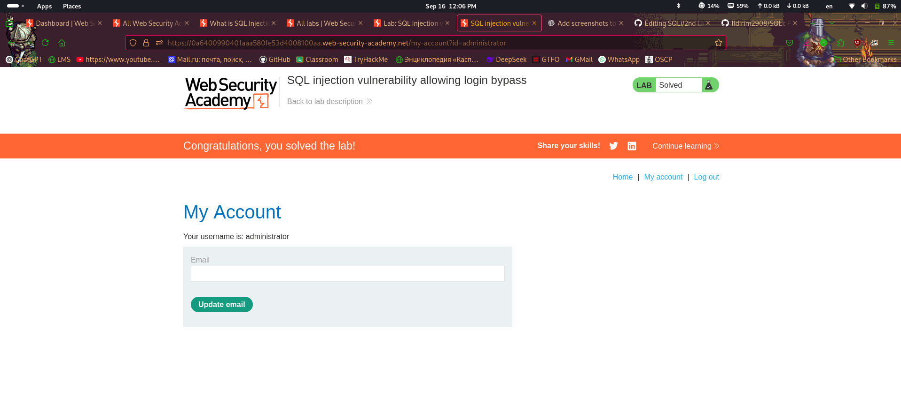

## Lab Description says

as we understand from here we will see login page that should be bypassed

## Login page

## Let's try one of the simplest payloads to bypass login page "' and 1=1-- -"

as we see from here we received 302 found response and got access to administrator account

## Administrator account

