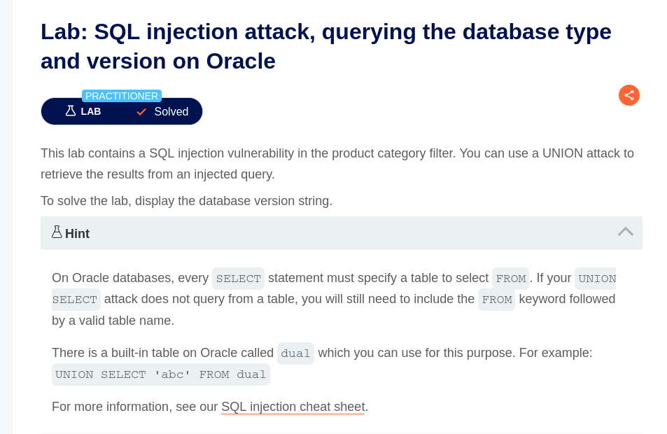
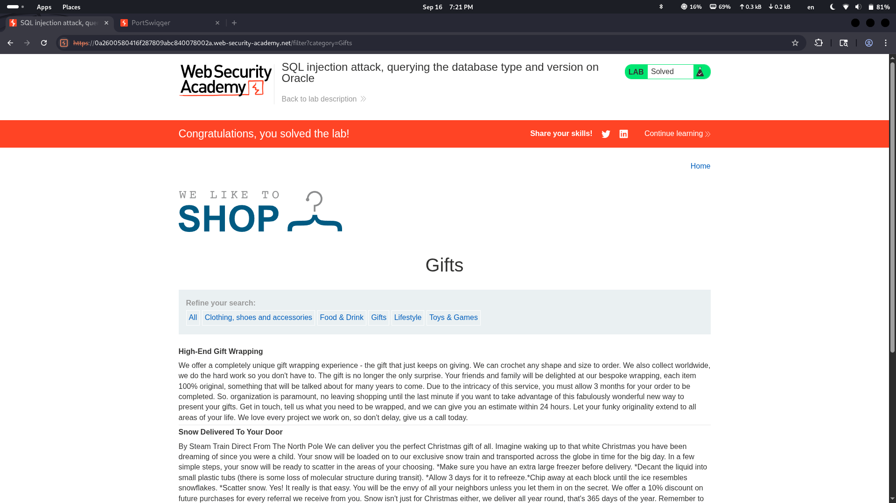
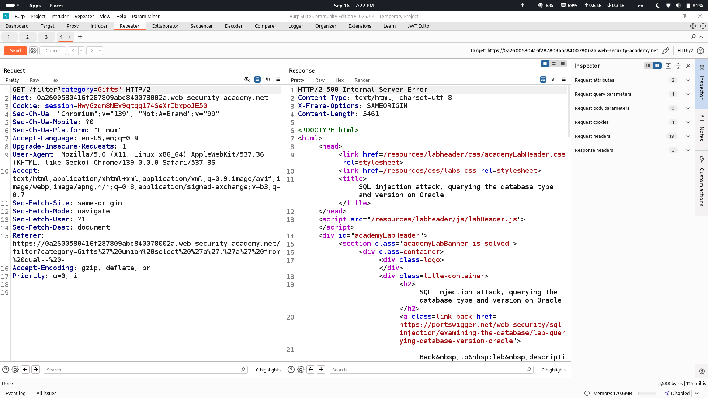
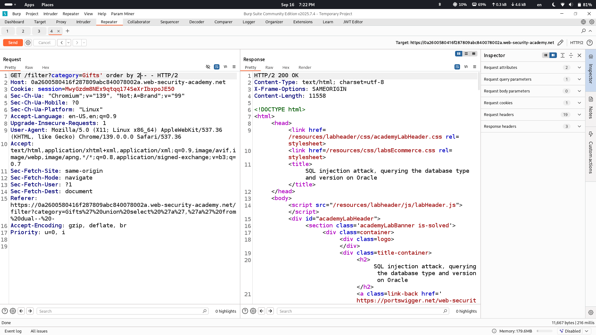

## Lab Description says

## Normal output of website

## Detecting SQLi vulnerability presenet by ' sign

## Detecting number of columns by "order by" method to further use union based injection method

