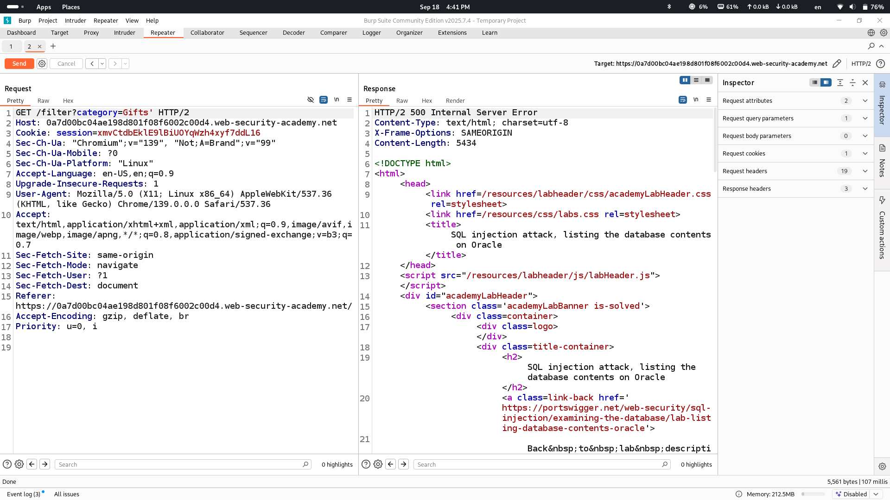
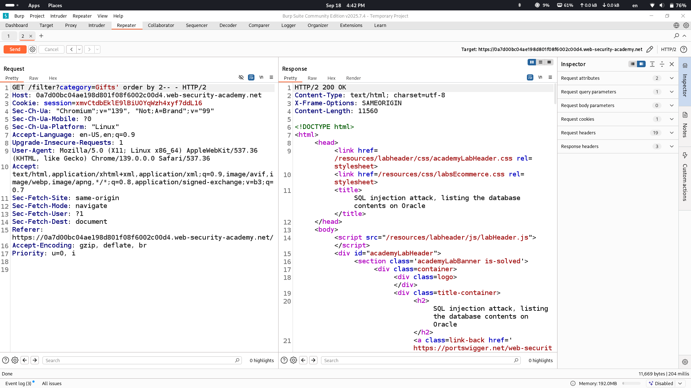
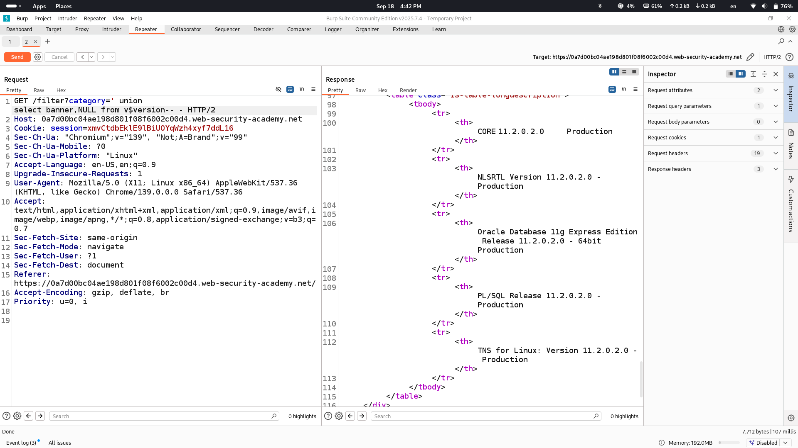
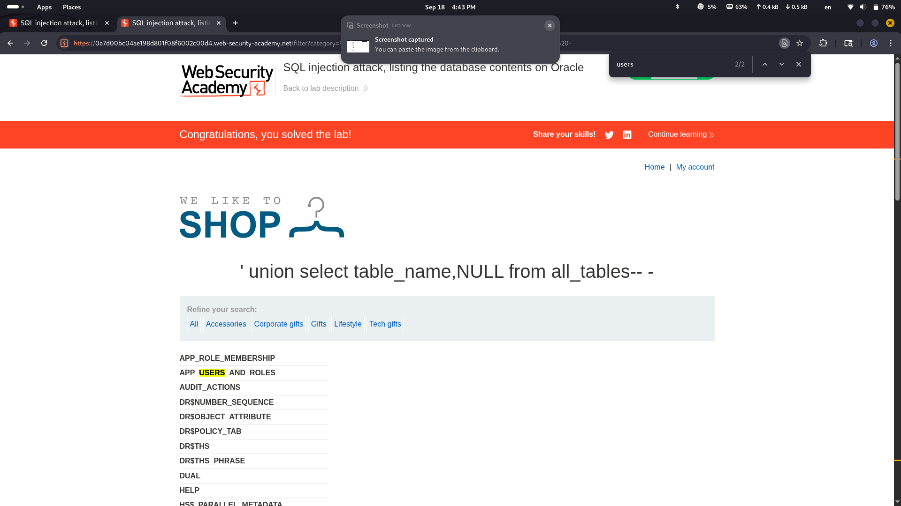
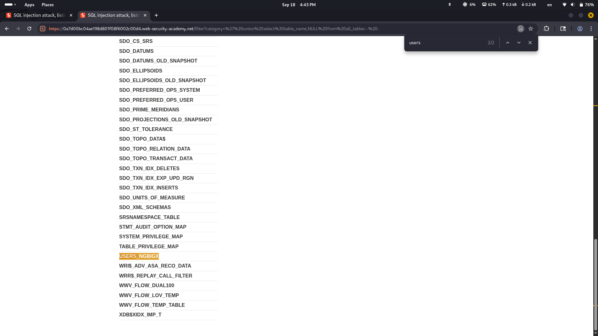
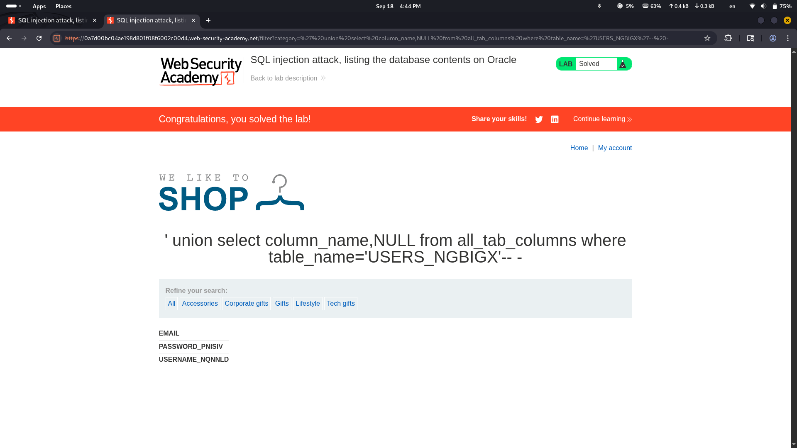
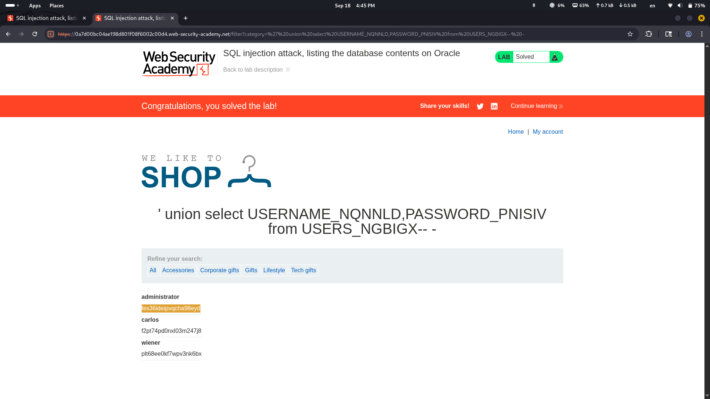
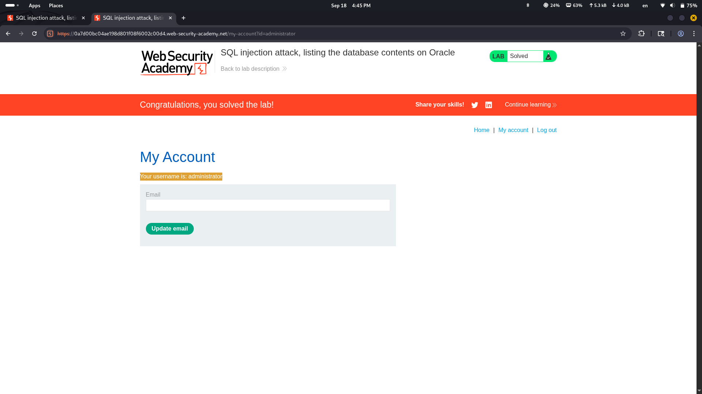

# Lab Description says

# Let's check the presence of sql injection by ' sign 

## as we see we got an error which potentially indicates that application is vulnerable to sql injection

# Let's see how many columns are queryed in original query on backend with order by technique

## two columns are queryed

# Let's see what database is used

## Oracle database is used

# It is time to enumerate table names to see where username and passwords could be stored

this is the payload that is used to retrieve table names

## this table seems to be the one

# When we retrieve columns we get this result

# And Finally let's see what is inside these columns

## and we see passwords of administrator and some other users

