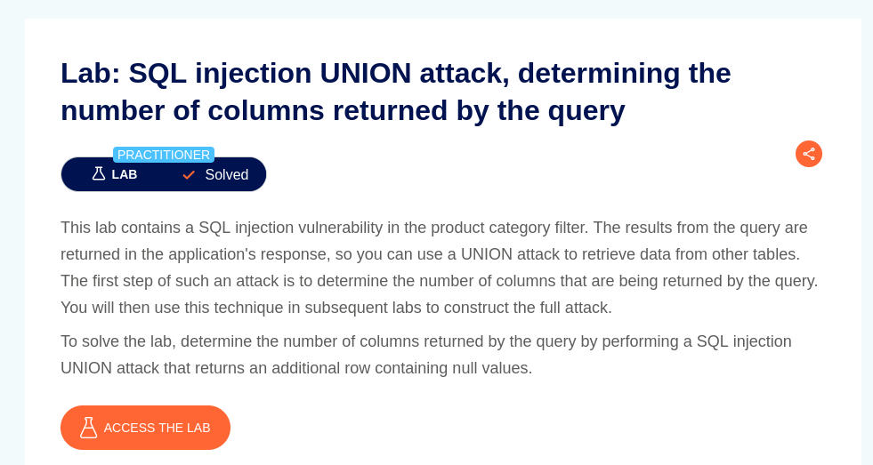
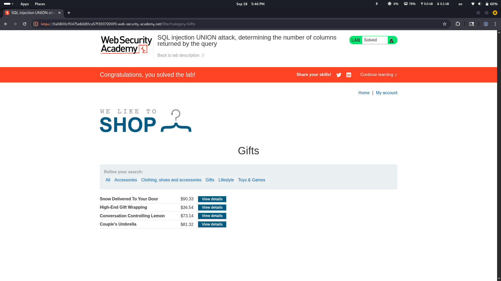
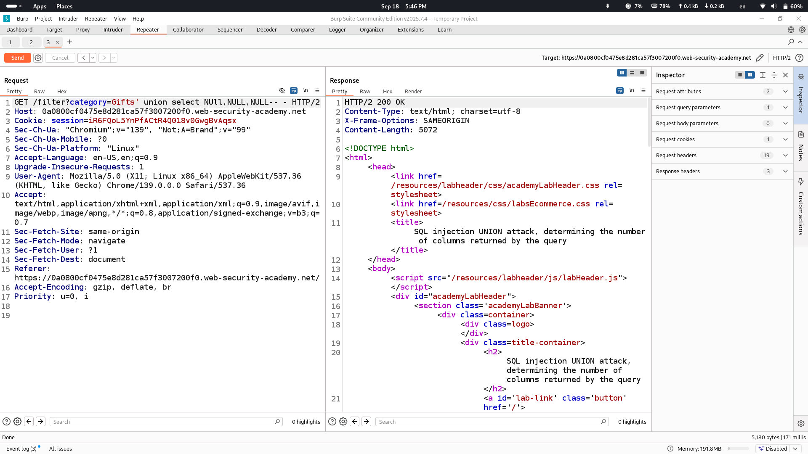

# Lab Description says

## we will simply use union injection so that application will not show us internal error

# Normal output of application

# Union based injection to see how many columns are returned

as wee see only 3 columns were in the original query
