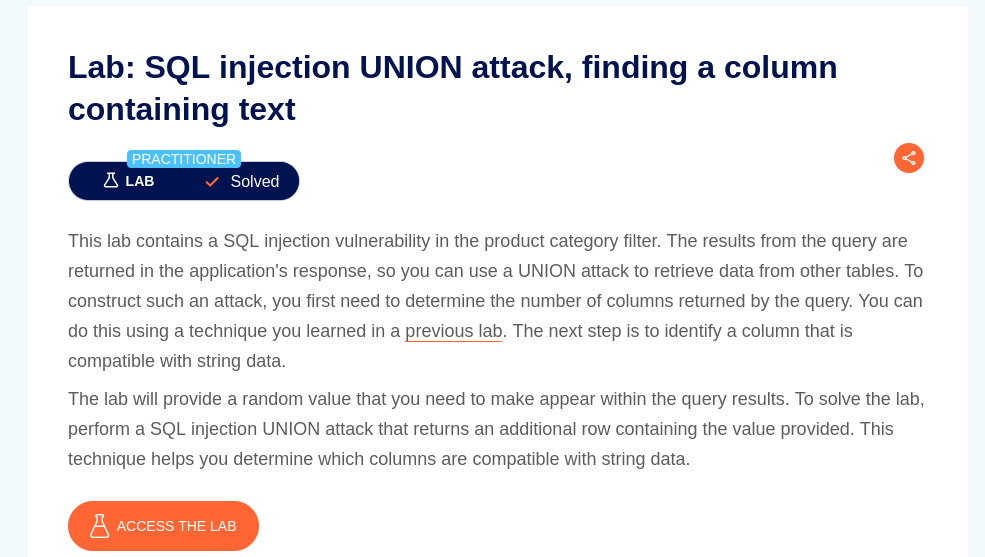
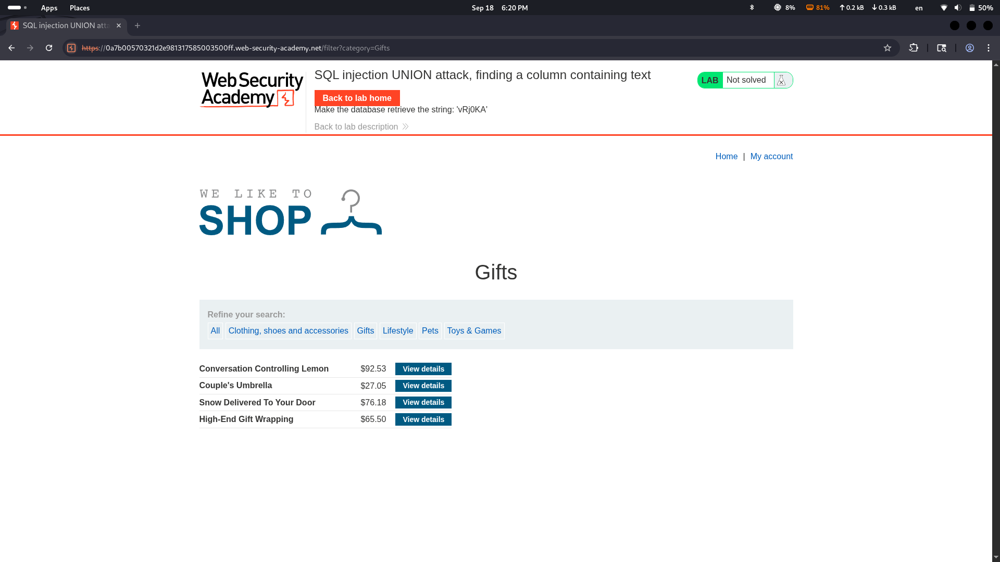
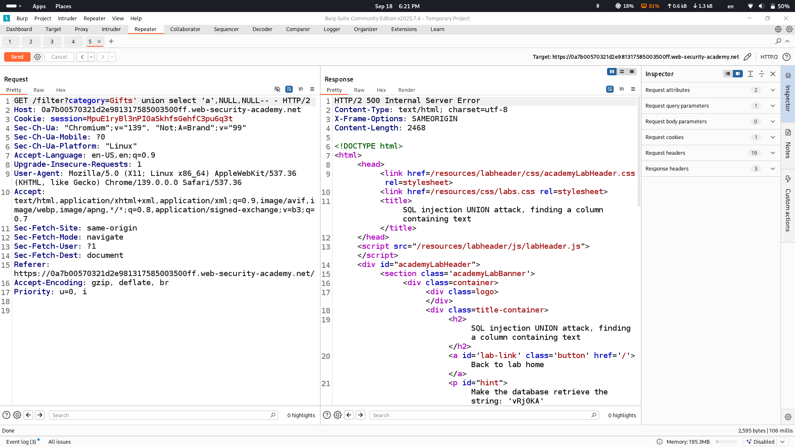
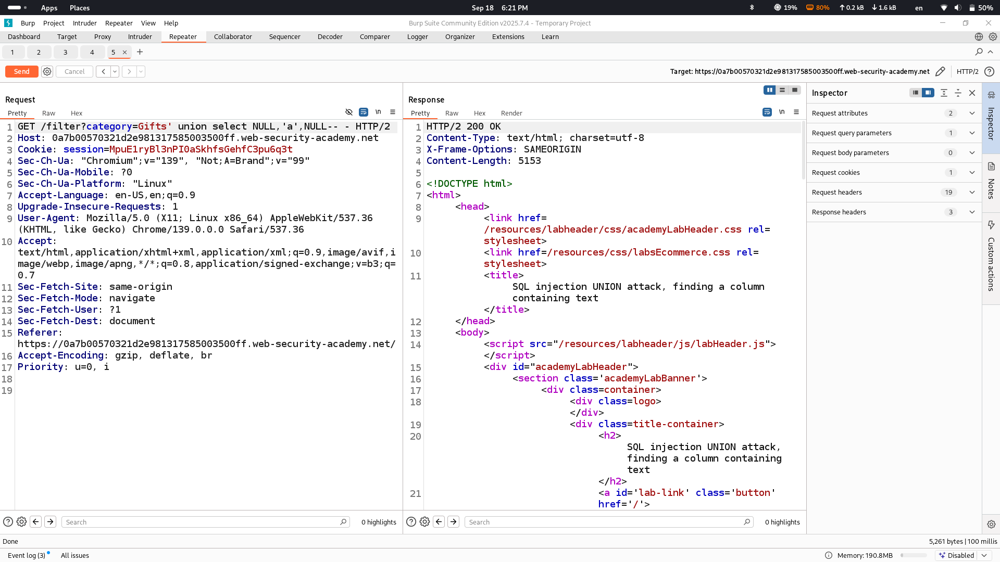
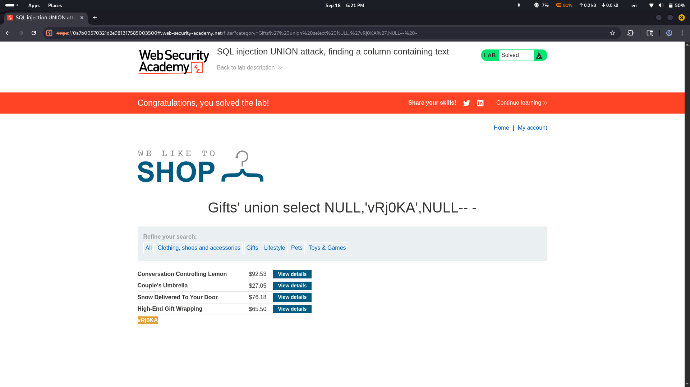

# Lab Description says

## we will make database retrieve the string in order to solve this lab
# Normal output of lab

# Let's see where we can input string to make database retrieve our text

## first column returns error let's check the second one

## second one is successful so we will use this column to retrieve some text

### Lab solved
