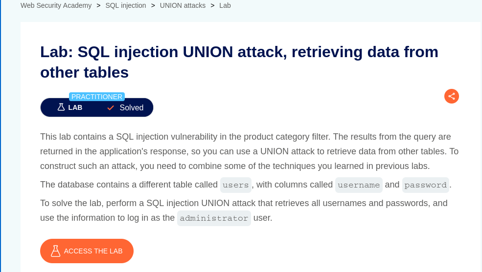
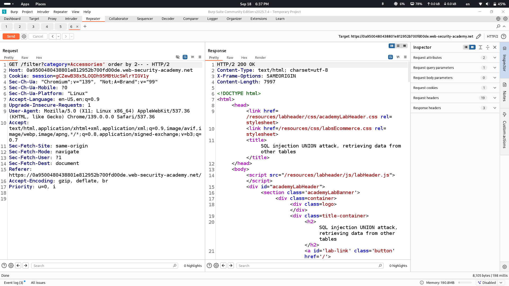
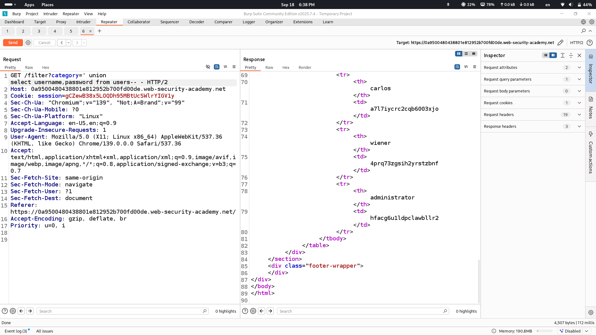
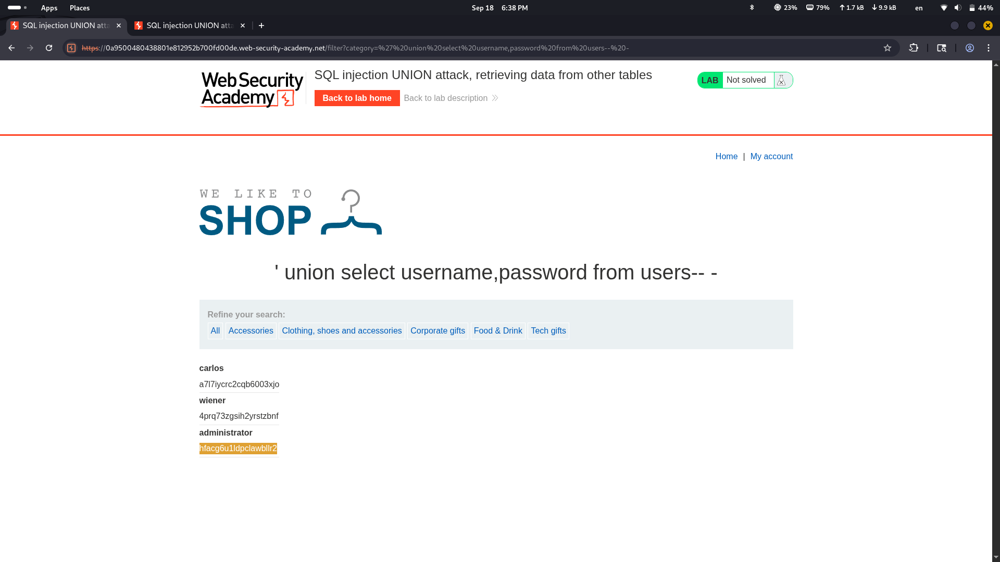
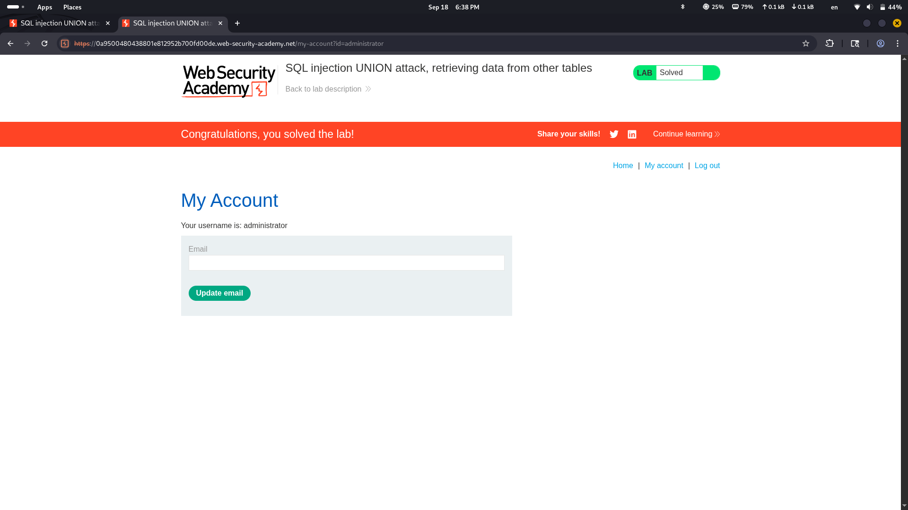

# Lab Description says

### we are given table name and column names the only thing we need to do is to inject payload and retrieve everything

# Let's see how many columns are used in original query with "Order by" technique

# Finally let's retrieve usernames and passwords that are in users table of this database

# Lab solved

